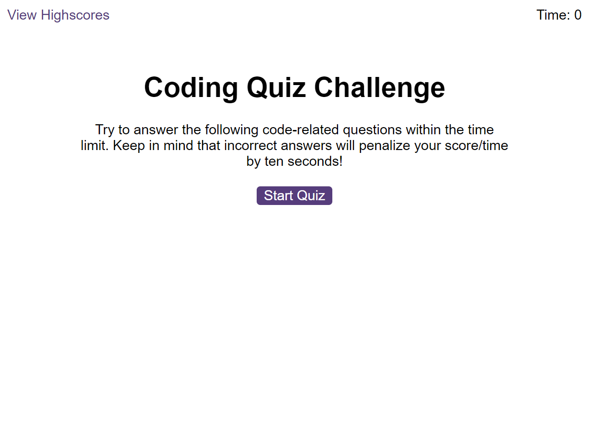
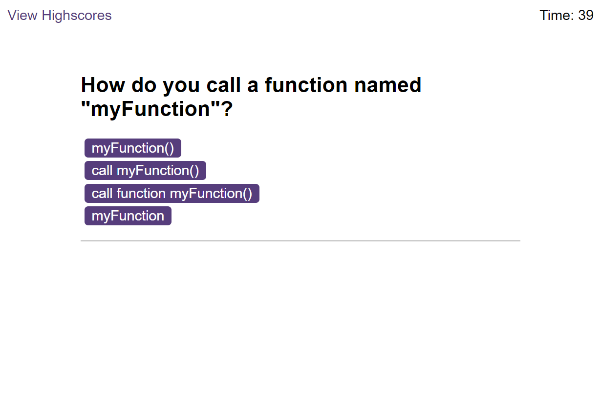

# Coding Quiz Application

## Description

This project is implemented for creating a quiz application on coding. The quiz tests the user on the different concepts of JavaScript.

Following list details the different parts of the quiz:

* There is a limited timer set for taking the quiz which starts at 75 seconds. 

* Total of five multiple choice questions are set.

* The user is notified if the selected answer is right or wrong.

* If a wrong answer is selected, there is a penalty of 10 seconds that is taken away from the timer.

* The quiz ends when either the time runs out or when all the questions have been answered.

* Final score is calculated to be the total time left at the end of quiz.

* At the end of quiz, the user can add their initials to be saved against their final score.

* The scores of other users who have taken the quiz can be found on the 'Highscores' page. This page can be accessed by the 'View Highscores' link.

* Previous highscores can also be cleared and reset by the user in the page.

## Installation

The application can be accessed at the following website:

https://jayapk21.github.io/Coding-Quiz-Application/

## Usage

Start the quiz by clicking on the 'Start Quiz' button.

Select the correct option in the quiz. The timer can be seen on the top right corner of the screen.

